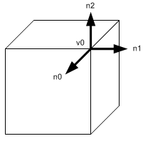

<section id="themes">
	<h2>Themes</h2>
		<p>
			Set your presentation theme: <br>
			<!-- Hacks to swap themes after the page has loaded. Not flexible and only intended for the reveal.js demo deck. -->
			<a href="#" onclick="document.getElementById('theme').setAttribute('href','css/theme/black.css'); return false;">Black (default)</a> -
			<a href="#" onclick="document.getElementById('theme').setAttribute('href','css/theme/white.css'); return false;">White</a> -
			<a href="#" onclick="document.getElementById('theme').setAttribute('href','css/theme/league.css'); return false;">League</a> -
			<a href="#" onclick="document.getElementById('theme').setAttribute('href','css/theme/sky.css'); return false;">Sky</a> -
			<a href="#" onclick="document.getElementById('theme').setAttribute('href','css/theme/beige.css'); return false;">Beige</a> -
			<a href="#" onclick="document.getElementById('theme').setAttribute('href','css/theme/simple.css'); return false;">Simple</a> <br>
			<a href="#" onclick="document.getElementById('theme').setAttribute('href','css/theme/serif.css'); return false;">Serif</a> -
			<a href="#" onclick="document.getElementById('theme').setAttribute('href','css/theme/night.css'); return false;">Night</a> -
			<a href="#" onclick="document.getElementById('theme').setAttribute('href','css/theme/moon.css'); return false;">Moon</a> -
			<a href="#" onclick="document.getElementById('theme').setAttribute('href','css/theme/solarized.css'); return false;">Solarized</a>
		</p>
</section>

H:

# Polygonal meshes

Jean Pierre Charalambos

H:

# Index

 1. Intro<!-- .element: class="fragment" data-fragment-index="1"-->
     1. Graphics Pipeline
     2. Polygonal Meshes
 2. Polygonal Meshes Representation<!-- .element: class="fragment" data-fragment-index="2"-->
     1. Bla
 3. OpenGL Polygonal Meshes<!-- .element: class="fragment" data-fragment-index="3"-->
     1. Bla
 4. Processing Polygonal Meshes<!-- .element: class="fragment" data-fragment-index="4"-->
 
H:

## Intro: Graphics Pipeline

```java
float angle;
void setup() {
  size(400, 400, P3D);
  noStroke();  
}

public void draw() {
  background(0);
  
  camera(width/2, height/2, 300, width/2, height/2, 0, 0, 1, 0);
  pointLight(200, 200, 200, width/2, height/2, 200);
  
  translate(width/2, height/2);
  rotateY(angle);
  
  beginShape(QUADS);
  normal(0, 0, 1);
  fill(50, 50, 200);
  vertex(-100, +100);
  vertex(+100, +100);
  fill(200, 50, 50);
  vertex(+100, -100);
  vertex(-100, -100);
  endShape();  
  
  angle += 0.01;
}
```

V:

## Intro: Graphics Pipeline

<figure>
    
    <figcaption>Graphics Pipeline</figcaption>
</figure>


```glsl
//vert.glsl
uniform mat4 transform;
attribute vec4 vertex;
attribute vec4 color;
varying vec4 vertColor;

void main() {
  gl_Position = transform * vertex;    
  vertColor = color;             
}
``` 
<!-- .element: class="fragment" data-fragment-index="1"-->


```glsl
//frag.glsl
varying vec4 vertColor;

void main() {
  gl_FragColor = vertColor;
}
```
<!-- .element: class="fragment" data-fragment-index="2"-->

V:

## Intro: Polygonal Meshes

<figure>
    
    <figcaption><a href="http://en.wikipedia.org/wiki/Stanford_bunny">The Standford Bunny</a></figcaption>
</figure>

V:

## Intro: Polygonal Meshes

<figure>
    
    <figcaption>Interior</a></figcaption>
</figure>

V:

## Intro: Polygonal Meshes

<figure>
    
    <figcaption><a href="http://en.wikipedia.org/wiki/Level_of_detail">Level-Of-Detail (LOD)</a></figcaption>
</figure>

V:

## Intro: Polygonal Meshes

<figure>
    
    <figcaption>Polygonal Terrain Mesh</a></figcaption>
</figure>

V:

## Intro: Polygonal Meshes

<section>
	<iframe data-autoplay width="420" height="345" src="http://www.youtube.com/embed/2UIgHTkqo9Q"></iframe>
</section>

H:

## Polygonal Meshes Representation

H:

## OpenGL Polygonal Meshes
### Deprecated Immediate Mode


```glsl
//Draw a cube with 12 tris.
glBegin(GL_TRIANGLES); 
    // front face =================
    glVertex3fv(v0);    // v0-v1-v2
    glVertex3fv(v1);
    glVertex3fv(v2);
    glVertex3fv(v2);    // v2-v3-v0
    glVertex3fv(v3);
    glVertex3fv(v0);

    // right face =================
    glVertex3fv(v0);    // v0-v3-v4
    glVertex3fv(v3);
    glVertex3fv(v4);
    glVertex3fv(v4);    // v4-v5-v0
    glVertex3fv(v5);
    glVertex3fv(v0);
    ...                 // draw other 4 faces

glEnd();
```

V:

## OpenGL Polygonal Meshes
### Immediate mode: Vertex Arrays / glVertexPointer() / glDrawArrays()


```glsl
GLfloat vertices[] = {...}; // 36 of vertex coords
...
// activate and specify pointer to vertex array
glEnableClientState(GL_VERTEX_ARRAY);
glVertexPointer(3, GL_FLOAT, 0, vertices);

// draw a cube
glDrawArrays(GL_TRIANGLES, 0, 36);

// deactivate vertex arrays after drawing
glDisableClientState(GL_VERTEX_ARRAY);
```

V:

## OpenGL Polygonal Meshes
### Immediate mode: Vertex Arrays / glVertexPointer() / glDrawElements()


```glsl
GLfloat vertices[] = {...};          // 8 of vertex coords
GLubyte indices[] = {0,1,2, 2,3,0,   // 36 of indices
                     0,3,4, 4,5,0,
                     0,5,6, 6,1,0,
                     1,6,7, 7,2,1,
                     7,4,3, 3,2,7,
                     4,7,6, 6,5,4};
...
// activate and specify pointer to vertex array
glEnableClientState(GL_VERTEX_ARRAY);
glVertexPointer(3, GL_FLOAT, 0, vertices);

// draw a cube
glDrawElements(GL_TRIANGLES, 36, GL_UNSIGNED_BYTE, indices);

// deactivate vertex arrays after drawing
glDisableClientState(GL_VERTEX_ARRAY);
```

V:

## OpenGL Polygonal Meshes
### Retained mode: (VBOs) / glVertexPointer() / glDrawElements()


```glsl
GLfloat vertices[] = {...};          // 8 of vertex coords
GLubyte indices[] = {0,1,2, 2,3,0,   // 36 of indices
                     0,3,4, 4,5,0,
                     0,5,6, 6,1,0,
                     1,6,7, 7,2,1,
                     7,4,3, 3,2,7,
                     4,7,6, 6,5,4};
...
```

V:

## OpenGL Polygonal Meshes
### Retained mode: (VBOs) / glVertexPointer() / glDrawElements()


```glsl
// Generate 2 VBOs
glGenBuffers(2, vboIds);
// Transfer vertex data to VBO 0
glBindBuffer(GL_ARRAY_BUFFER, vboIds[0]);
glBufferData(GL_ARRAY_BUFFER, sizeof(vertices), vertices, GL_STATIC_DRAW);
// Transfer index data to VBO 1
glBindBuffer(GL_ELEMENT_ARRAY_BUFFER, vboIds[1]);
glBufferData(GL_ELEMENT_ARRAY_BUFFER,sizeof(indices),indices,GL_STATIC_DRAW);
```

V:

## OpenGL Polygonal Meshes
### Retained mode: (VBOs) / glVertexPointer() / glDrawElements()


```glsl
glBindBufferARB(GL_ARRAY_BUFFER_ARB, vboId1);
glBindBufferARB(GL_ELEMENT_ARRAY_BUFFER_ARB, vboId2);
...
// activate and specify pointer to vertex array
glEnableClientState(GL_VERTEX_ARRAY);
glVertexPointer(3, GL_FLOAT, 0, 0);

// draw a cube
glDrawElements(GL_TRIANGLES,
                            36, GL_UNSIGNED_BYTE, 0);

// deactivate vertex arrays after drawing
glDisableClientState(GL_VERTEX_ARRAY);
```

V:

## OpenGL Polygonal Meshes
### Arrays



1. glVertexPointer()
2. glNormalPointer()
3. glColorPointer()
4. glIndexPointer()
5. glTexCoordPointer()
6. glEdgeFlagPointer()

V:

## OpenGL Polygonal Meshes
### glDrawElements [modes](https://www.opengl.org/sdk/docs/man/html/glDrawElements.xhtml)

* GL_POINTS
* GL_LINE_STRIP, GL_LINE_LOOP, GL_LINES, GL_LINE_STRIP_ADJACENCY, GL_LINES_ADJACENCY
* GL_TRIANGLE_STRIP
* GL_TRIANGLE_FAN
* *GL_TRIANGLES*
* GL_TRIANGLE_STRIP_ADJACENCY
* GL_TRIANGLES_ADJACENCY
* GL_PATCHES

H:

## Processing Polygonal Meshes
### Immediate mode

```java
beginShape(TRIANGLE_STRIP);
vertex(30, 75);
vertex(40, 20);
vertex(50, 75);
vertex(60, 20);
vertex(70, 75);
vertex(80, 20);
vertex(90, 75);
endShape();
```

V:

## Processing Polygonal Meshes
### Retained mode

```java
PShape s;

void setup() {
  size(100, 100, P2D);
  s = createShape();
  s.beginShape(TRIANGLE_STRIP);
  s.vertex(30, 75);
  s.vertex(40, 20);
  s.vertex(50, 75);
  s.vertex(60, 20);
  s.vertex(70, 75);
  s.vertex(80, 20);
  s.vertex(90, 75);
  s.endShape();
}

void draw() {
  shape(s, 0, 0);
}
```

V:

## Processing Polygonal Meshes
### [beginShape() parameters](https://processing.org/reference/beginShape_.html)

* POINTS
* LINES
* TRIANGLES
* TRIANGLE_STRIP
* TRIANGLE_FAN
* QUADS
* QUAD_STRIP

H:

## References

