<section id="themes">
	<h2>Themes</h2>
		<p>
			Set your presentation theme: <br>
			<!-- Hacks to swap themes after the page has loaded. Not flexible and only intended for the reveal.js demo deck. -->
                        <a href="#" onclick="document.getElementById('theme').setAttribute('href','css/theme/black.css'); return false;">Black (default)</a> -
			<a href="#" onclick="document.getElementById('theme').setAttribute('href','css/theme/white.css'); return false;">White</a> -
			<a href="#" onclick="document.getElementById('theme').setAttribute('href','css/theme/league.css'); return false;">League</a> -
			<a href="#" onclick="document.getElementById('theme').setAttribute('href','css/theme/sky.css'); return false;">Sky</a> -
			<a href="#" onclick="document.getElementById('theme').setAttribute('href','css/theme/beige.css'); return false;">Beige</a> -
			<a href="#" onclick="document.getElementById('theme').setAttribute('href','css/theme/simple.css'); return false;">Simple</a> <br>
			<a href="#" onclick="document.getElementById('theme').setAttribute('href','css/theme/serif.css'); return false;">Serif</a> -
			<a href="#" onclick="document.getElementById('theme').setAttribute('href','css/theme/blood.css'); return false;">Blood</a> -
			<a href="#" onclick="document.getElementById('theme').setAttribute('href','css/theme/night.css'); return false;">Night</a> -
			<a href="#" onclick="document.getElementById('theme').setAttribute('href','css/theme/moon.css'); return false;">Moon</a> -
			<a href="#" onclick="document.getElementById('theme').setAttribute('href','css/theme/solarized.css'); return false;">Solarized</a>
		</p>
</section>

H:

# Polygonal meshes

Jean Pierre Charalambos

H:

# Index

 1. Intro<!-- .element: class="fragment" data-fragment-index="1"-->
     * Graphics Pipeline & Polygonal Meshes
 2. Polygonal Meshes Representation<!-- .element: class="fragment" data-fragment-index="2"-->
     * Vertex-vertex meshes & Explicit representation
     * Face-vertex meshes & Face-edge meshes
 3. OpenGL Polygonal Meshes<!-- .element: class="fragment" data-fragment-index="3"-->
     * Deprecated Immediate Mode
     * Modern Immediate Mode
     * Modern Retained Mode
 4. Processing and Proscene Polygonal Meshes<!-- .element: class="fragment" data-fragment-index="4"-->
     * Immediate Mode & Retained Mode
  
H:

## Intro

  1. Graphics Pipeline
  2. Polygonal Meshes

V:

## Intro: Graphics Pipeline

<div class="ulist">
    
    <ul style="width: 30%;">
        <p class="fragment" data-fragment-index="1">Polygonal meshes</p>
        <p class="fragment" data-fragment-index="2">Triangular: std</p>
        <p class="fragment" data-fragment-index="3">Curves and surfaces</p>
    </ul>
</div>

V:

## Intro: Polygonal Meshes

<figure>
    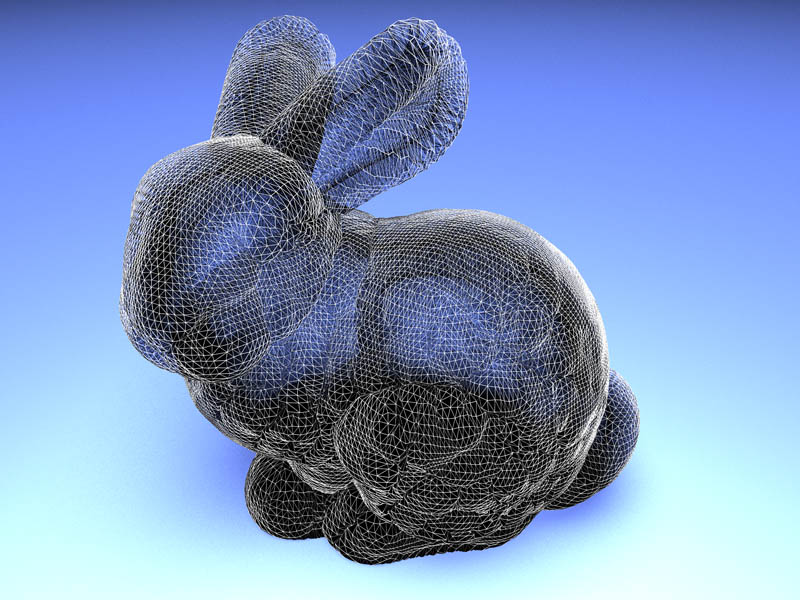
    <figcaption><a href="http://en.wikipedia.org/wiki/Stanford_bunny">The Standford Bunny</a></figcaption>
</figure>

V:

## Intro: Polygonal Meshes

<figure>
    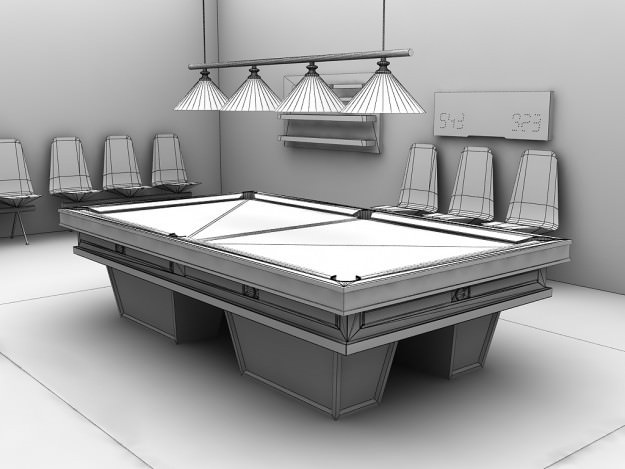
    <figcaption>Interior</a></figcaption>
</figure>

V:

## Intro: Polygonal Meshes

<figure>
    
    <figcaption><a href="http://en.wikipedia.org/wiki/Level_of_detail">Level-Of-Detail (LOD)</a></figcaption>
</figure>

V:

## Intro: Polygonal Meshes

<figure>
    
    <figcaption>Polygonal Terrain Mesh</a></figcaption>
</figure>

V:

## Intro: Polygonal Meshes

<section>
	<iframe data-autoplay width="420" height="345" src="http://www.youtube.com/embed/2UIgHTkqo9Q"></iframe>
</section>

V:

## Intro: Polygonal Meshes Modes

 1. Immediate Mode
    * lists of objects to be rendered are NOT saved by GL
    * each frame: app must re-issue all drawing commands 
    * Maximum control and flexibility by the app
    
 2. Retained Mode
    * lists of objects to be rendered are saved by GL
    * each frame: app calls -> update model
    * Allows GL to optimize rendering (when, processing,...)
    
N:
+ Immediate Mode -> app must re-issue all drawing commands required to describe the entire scene
+ Retained mode -> models should be generated first

H:

## Polygonal Meshes Representation

* Vertex-vertex meshes
* Explicit representation
* Face-vertex meshes
* Face-edge meshes

V:

## Polygonal Meshes Representation
### Vertex-vertex meshes

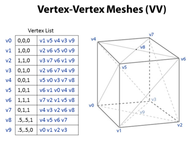

N:
+ simplest representation
+ not widely used: faces are implicit
+ small storage space 
+ efficient morphing of shape

V:

## Polygonal Meshes Representation
### Explicit representation


N:
+ simple representation
+ widely used: faces are explicit
+ higher storage space 
+ inefficient morphing of shape

V:

## Polygonal Meshes Representation
### Face-vertex meshes

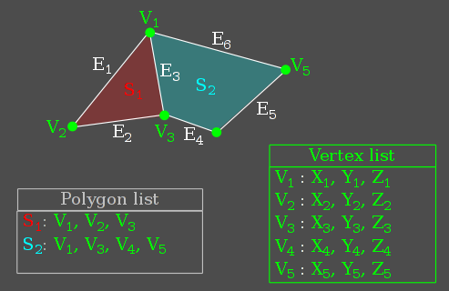

N:
+ most widely used (see OpenGL section)
+ lower storage space 
+ efficient morphing of shape

V:

## Polygonal Meshes Representation
### Face-vertex meshes

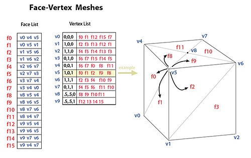

N:
+ Same but lists faces that surround a vertex

V:

## Polygonal Meshes Representation
### Face-edge meshes

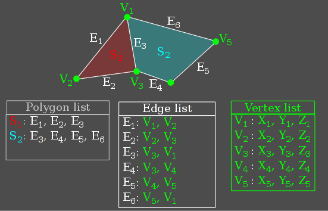

N:
+ Similar than fv's, but adds edge info
+ Hard to find vertex incident edges

V:

## Polygonal Meshes Representation
### Helf-edge meshes

* Half-edges -> split edges in two oriented parts
* Half-edges store the main connectivity information:

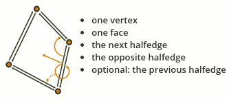

N:
+ [openmesh](openmesh.org)

V:

## Polygonal Meshes Representation
### Helf-edge meshes

<figure>
    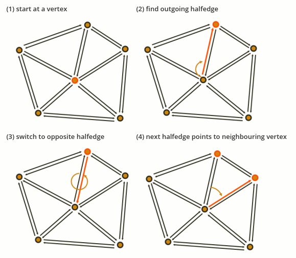
    <figcaption>Vertex one-ring neighborhood</figcaption>
</figure>

N:
+ Critical operation for several algorithms

H:

## OpenGL Polygonal Meshes

* Deprecated Immediate Mode
* Modern Immediate Mode
* Modern Retained Mode

N:
+ Old fashioned Retained Mode: Display Lists

V:

## OpenGL Polygonal Meshes
### Deprecated Immediate Mode

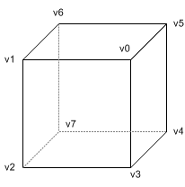


```glsl
//Draw a cube
// 36 of vertex coords: 3 vertices per tri
//                      12 tris (2 per face)
glBegin(GL_TRIANGLES); 
    // front face =================
    glVertex3f(x0,y0,z0);    // v0
    glVertex3f(x1,y1,z1);    // v1
    glVertex3f(x2,y2,z2);    // v2
    glVertex3f(x2,y2,z2);    // v2
    glVertex3f(x3,y3,z3);    // v3
    glVertex3f(x0,y0,z0);    // v0

    // right face =================
    glVertex3f(x0,y0,z0);    // v0
    glVertex3f(x3,y3,z3);    // v3
    glVertex3f(x4,y4,z4);    // v4
    glVertex3f(x4,y4,z4);    // v4
    glVertex3f(x5,y5,z5);    // v5
    glVertex3f(x0,y0,z0);    // v0
    ...                 // draw other 4 faces

glEnd();
```

N:
+ Same as explicit mesh representation.
+ Geometry should be transfer every frame.

V:

## OpenGL Polygonal Meshes
### Deprecated Immediate Mode


```glsl
//Draw a cube where somewhere in your application you have:
// v0 : [x0,y0,z0]
// v1 : [x0,y0,z0]
// ...
// v7 : [x7,y7,z7]
glBegin(GL_TRIANGLES); 
    // front face =================
    // v0-v1-v2
    glVertex3fv(v0);
    glVertex3fv(v1);
    glVertex3fv(v2);   
    // v2-v3-v0
    glVertex3fv(v2);
    glVertex3fv(v3);
    glVertex3fv(v0);

    // right face =================
    // v0-v3-v4
    glVertex3fv(v0);
    glVertex3fv(v3);
    glVertex3fv(v4);
    // v4-v5-v0
    glVertex3fv(v4);
    glVertex3fv(v5);
    glVertex3fv(v0);
    ...                 // draw other 4 faces

glEnd();
```

N:
+ Same as face-vertex mesh representation.
+ Geometry should be transfer every frame.

V:

## OpenGL Polygonal Meshes
Immediate mode: Vertex Arrays / glVertexPointer() / glDrawArrays()


```glsl
GLfloat vertices[] = {...}; // 36 of vertex coords
...
// activate and specify pointer to vertex array
glEnableClientState(GL_VERTEX_ARRAY);
glVertexPointer(3, GL_FLOAT, 0, vertices);

// draw a cube
glDrawArrays(GL_TRIANGLES, 0, 36);

// deactivate vertex arrays after drawing
glDisableClientState(GL_VERTEX_ARRAY);
```

N:
+ Same as explicit mesh representation

V:

## OpenGL Polygonal Meshes
Immediate mode (specification & rendering): Vertex Arrays / glVertexPointer() / glDrawElements()


```glsl
GLfloat vertices[] = {...};          // 8 of vertex coords
GLubyte indices[] = {0,1,2, 2,3,0,   // 36 of indices
                     0,3,4, 4,5,0,
                     0,5,6, 6,1,0,
                     1,6,7, 7,2,1,
                     7,4,3, 3,2,7,
                     4,7,6, 6,5,4};
...
// activate and specify pointer to vertex array
glEnableClientState(GL_VERTEX_ARRAY);
glVertexPointer(3, GL_FLOAT, 0, vertices);

// draw a cube
glDrawElements(GL_TRIANGLES, 36, GL_UNSIGNED_BYTE, indices);

// deactivate vertex arrays after drawing
glDisableClientState(GL_VERTEX_ARRAY);
```

N:
+ Same as face-vertex mesh representation

V:

## OpenGL Polygonal Meshes
Retained mode: (VBOs specification) / glVertexPointer() / glDrawElements()


```glsl
GLfloat vertices[] = {...};          // 8 of vertex coords
GLubyte indices[] = {0,1,2, 2,3,0,   // 36 of indices
                     0,3,4, 4,5,0,
                     0,5,6, 6,1,0,
                     1,6,7, 7,2,1,
                     7,4,3, 3,2,7,
                     4,7,6, 6,5,4};
...
```

N:
+ Same access functions as with vertex-arrays

V:

## OpenGL Polygonal Meshes
Retained mode: (VBOs generation and transfer) / glVertexPointer() / glDrawElements()


```glsl
// Generate 2 VBOs
glGenBuffers(2, vboIds);
// Transfer vertex data to VBO 0
glBindBuffer(GL_ARRAY_BUFFER, vboIds[0]);
glBufferData(GL_ARRAY_BUFFER, sizeof(vertices), vertices, GL_STATIC_DRAW);
// Transfer index data to VBO 1
glBindBuffer(GL_ELEMENT_ARRAY_BUFFER, vboIds[1]);
glBufferData(GL_ELEMENT_ARRAY_BUFFER,sizeof(indices),indices,GL_STATIC_DRAW);
```

V:

## OpenGL Polygonal Meshes
Retained mode: (VBOs rendering) / glVertexPointer() / glDrawElements()


```glsl
glBindBufferARB(GL_ARRAY_BUFFER_ARB, vboId1);
glBindBufferARB(GL_ELEMENT_ARRAY_BUFFER_ARB, vboId2);
...
// activate and specify pointer to vertex array
glEnableClientState(GL_VERTEX_ARRAY);
glVertexPointer(3, GL_FLOAT, 0, 0);

// draw a cube
glDrawElements(GL_TRIANGLES, 36, GL_UNSIGNED_BYTE, 0);

// deactivate vertex arrays after drawing
glDisableClientState(GL_VERTEX_ARRAY);
```

V:

## OpenGL Polygonal Meshes

glDrawElements() [modes](https://www.opengl.org/sdk/docs/man/html/glDrawElements.xhtml)

* GL_POINTS
* GL_LINE_STRIP, GL_LINE_LOOP, GL_LINES, GL_LINE_STRIP_ADJACENCY, GL_LINES_ADJACENCY
* GL_TRIANGLE_STRIP
* GL_TRIANGLE_FAN
* *GL_TRIANGLES*
* GL_TRIANGLE_STRIP_ADJACENCY
* GL_TRIANGLES_ADJACENCY
* GL_PATCHES

H:

## Processing Polygonal Meshes
### Immediate mode

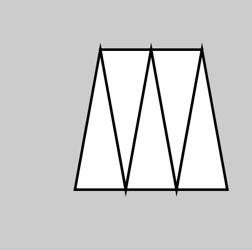

```java
beginShape(TRIANGLE_STRIP);
vertex(30, 75);
vertex(40, 20);
vertex(50, 75);
vertex(60, 20);
vertex(70, 75);
vertex(80, 20);
vertex(90, 75);
endShape();
```

N:
+ Same as explicit mesh representation, i.e., face-vertex mesh representation is missed

V:

## Processing Polygonal Meshes
### Retained mode


```java
PShape s;

void setup() {
  size(100, 100, P2D);
  s = createShape();
  s.beginShape(TRIANGLE_STRIP);
  s.vertex(30, 75);
  s.vertex(40, 20);
  s.vertex(50, 75);
  s.vertex(60, 20);
  s.vertex(70, 75);
  s.vertex(80, 20);
  s.vertex(90, 75);
  s.endShape();
}

void draw() {
  shape(s, 0, 0);
}
```

N:
+ Same as explicit mesh representation, i.e., face-vertex mesh representation is missed

V:

## Processing Polygonal Meshes

[beginShape() parameters](https://processing.org/reference/beginShape_.html)

* POINTS
* LINES
* TRIANGLES
* TRIANGLE_STRIP
* TRIANGLE_FAN
* QUADS
* QUAD_STRIP

V:

## Processing Polygonal Meshes: [hemesh](http://www.wblut.com/he_mesh/)

<figure>
    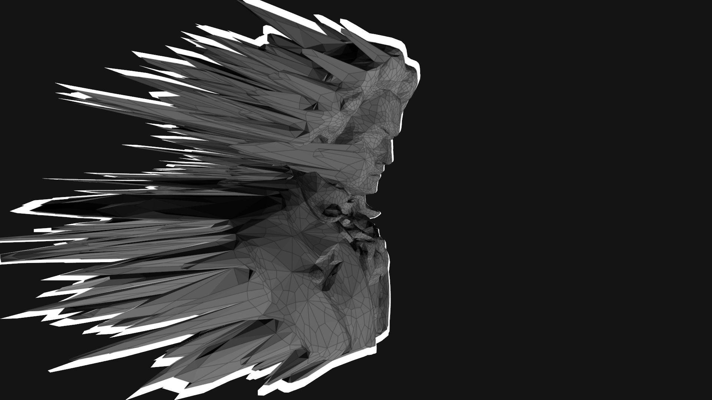
</figure>

V:

## Processing Polygonal Meshes: [hemesh](http://www.wblut.com/he_mesh/)

* Creation
* Modification
* Subdivision
* Selection

H:

## References
Polygonal meshes

* [Polygonal meshes](https://en.wikipedia.org/wiki/Polygon_mesh)
* [hemesh](http://www.wblut.com/he_mesh/)

V:

## References
OpenGL

* [Deprecated Immediate Mode](http://www.songho.ca/opengl/gl_overview.html#glbegin)
* [Modern Immediate Mode](http://www.songho.ca/opengl/gl_vertexarray.html)
* [Modern Retained Mode](http://www.songho.ca/opengl/gl_vbo.html)

V:

## References
Processing

* [Processing Shader Tutorial](https://processing.org/tutorials/pshader/)
* Processing Immediate Mode: All ```beginShape/endShape``` examples
* Processing Retained mode: All ```PShape``` examples
* Processing [Low-Level, via OpenGL](https://github.com/processing/processing/wiki/Advanced-OpenGL)

H:

## Workshop

> Draw the [platonic solids](https://en.wikipedia.org/wiki/Platonic_solid) immediate and retained Processing modes

Optionals:
1. Doing it in OpenGL
2. Doing it using [hemesh](http://www.wblut.com/he_mesh/)
